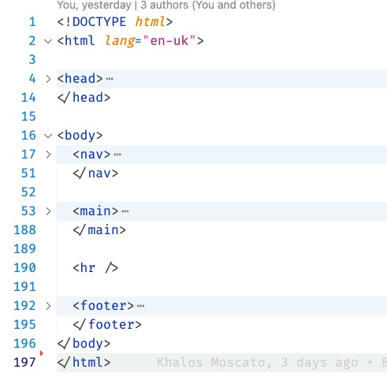
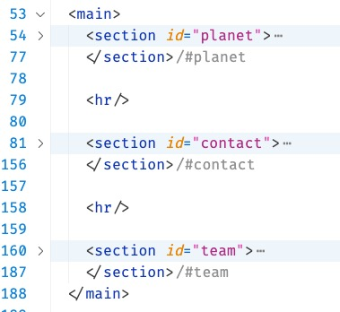
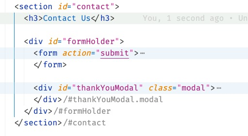

# Week 1: Induction, Basics & Agency Website

## 1. Learning Outcomes

- [Week 01](https://learn.foundersandcoders.com/course/syllabus/developer/week01-project01-basics/learning-outcomes/)

## 2. Achievements

### 2A. Accessibility

<details><summary>Structure a site using semantic HTML to aid accessibility</summary>

---







---

</details>

### 2B. Design

<details><summary>Use CSS variables to apply repeated colours to HTML elements</summary>

---

> Centre of our idea from the start. We also used JS to dynamically change the values assigned to the CSS variables, in an attempt to create colour schemes that reflected the planet chosen by the user.

#### style.css

```CSS
    :root {
        --color-1: #000000;
        --color-2: #ffff;
        --color-3: #6b6969;
    }

    body {
        font-family: Arial, Helvetica, sans-serif;
        color: var(--color-2);
        background-color: var(--color-1);
    }
```

---

</details>

<details><summary>Use CSS Flexbox to style children in a single-direction layout (ie a row or a column)</summary>

---

> para

---

</details>

<details><summary>Use CSS Grid to style children in two-direction layout</summary>

---

> para

---

</details>

### 2C. Workflow

<details><summary>Ensure our Git commit history tells a coherent story</summary>

---

> I think I was pretty good at annotating my commit messages & supporting my team in developing coherent git practices

---

</details>

### 2D. HTML Forms

<details><summary>Use the appropriate input types in HTML forms for gathering different types of information</summary>

---

> Quite chuffed with this

```html
<form action="submit">
  <div class="formContainer">
    <fieldset id="formName">
      <legend>Your Details</legend>

      <label for="name1">Name 1</label>
      <input type="text" id="name1" name="name1" />

      <label for="name2">Name 2</label>
      <input type="text" id="name2" name="name2" />

      <label for="email">Email</label>
      <input type="email" id="email" />
    </fieldset>

    <fieldset id="formMessage">
      <legend>Message</legend>

      <textarea
        name="message"
        rows="10"
        cols="30"
        placeholder="Share your thoughts!"
      >
      </textarea>
    </fieldset>

    <fieldset id="formTrip">
      <legend>Getaway</legend>

      <label for="birthday">Date of Birth</label>
      <input type="date" id="birthday" name="birthday" />

      <label for="age1">Age Now</label>
      <output id="age1" for="birthday"></output>

      <label for="planetsList">Destination</label>
      <input id="planetsForm" list="planetsList" />
      <datalist id="planetsList">
        <option value="The Sun"></option>
        <option value="Mercury"></option>
        <option value="Venus"></option>
        <option value="Earth"></option>
        <option value="Mars"></option>
        <option value="Jupiter"></option>
        <option value="Saturn"></option>
        <option value="Neptune"></option>
        <option value="Uranus"></option>
      </datalist>

      <label for="travelTime">Journey Time in Years</label>
      <output id="travelTime"></output>

      <label for="age2">Age on Arrival</label>
      <output id="age2"></output>

      <label for="age3">Age on Return</label>
      <output id="age3"></output>
    </fieldset>
  </div>

  <div id="form3-1">
    <button>Book Your Getaway</button>
  </div>
</form>
```

---

</details>

- Ensure that forms are accessible and include appropriate labeling for screen readers (included in above point)

---

## 3. Difficulties

- Ensure our UI has sufficient colour contrast so that everyone can perceive it comfortably
  - > Admittedly I didn't have direct input on the colour schemes used, but I was aware that several of them were deeply unreadable and I didn't challenge it.
  - > At the time, I rationalised that as being respectful of someone else's work-in-progress, but I think I was actually avoiding the issue due to being concerned about a lack of time.
- Demonstrate a mobile-first approach to building a website
  - > I continue to think in very single-device terms, and want to find ways to have flexibility present within my design thinking from the start

## 4. Feedback (For CF's)

[**Course Facilitator name**]

Alexander

[*What went well*]

Very good example of a progress log. All topics are well explained and supported with code snippets. It also shows some interest in covering some areas that usually are overlooked, like accessibility.

[*Even better if*]

Feel free to curate your code snippets a bit more. The idea is to keep them as short as possible while still providing enough info to support the topic you're explaining. There's no need to keep your code identical to the original.
