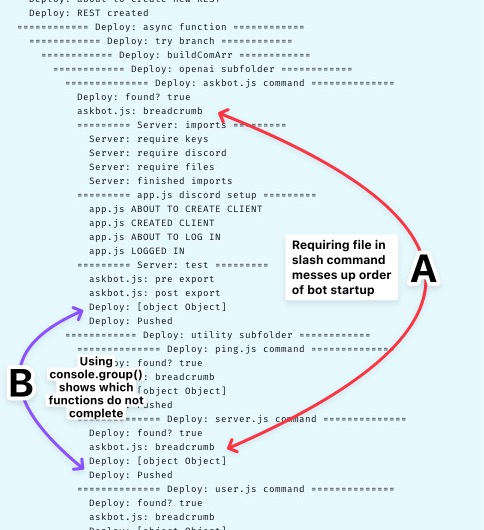

# Week 2: Async JS & Server Introduction

> [Learning Outcomes](https://learn.foundersandcoders.com/course/syllabus/developer/week02-project02-chatbot/learning-outcomes/)

## Achievements

<details>
<summary><strong>1. Access values that aren’t available synchronously</strong></summary>

---

```js
    const { bridge } = require('../../../app');

    /* export the data attribute, then... */

    async execute(interaction) {
        await interaction.deferReply();
        const question = interaction.options.getString('question');
        const reply = await bridge(question);
        await interaction.editReply(reply);
    }
```

</details>

<details>
<summary><strong>2. Filter & Map</strong></summary>

---

> `discord.js`'s `Collection()` method is essentially a `Map()` with additional utilities

```js
    const { Collection } = require('discord.js');

    client.commands = new Collection();
```

---

> Running a `filter()` on `./discord/commands/` to return only `.js` files

```js
    const comPath = path.join(__dirname, 'commands');
    const comSubs = fs.readdirSync(comPath); 
    
    for (const sub of comSubs) {
        const subPath = path
            .join(comPath, sub);
        const subFiles = fs
            .readdirSync(subPath)
            .filter(file => file.endsWith('.js'));
        /* more stuff */
    }
```

---

</details>

<details>
<summary><strong>3. Managing project dependencies with `npm`</strong></summary>

---

```json
    "dependencies": {
        "discord.js": "^14.16.2",
        "dotenv": "^16.4.5",
        "openai": "^4.61.1"
    }
```

---

</details>

<details>
<summary><strong>4. Protecting keys & secrets</strong></summary>

---

> I like to store my `.env` values in an object. It helps with coherent naming and means I can fold it all out of sight

```js
    const dotenv = require('dotenv').config();
    const keys = {
        discord: {
            /* other discord keys */
            token: process.env.DISCORD_TOKEN,
        },
        /* other APIs */
    };
    
    /* other stuff */

    client.login(keys.discord.token);
```

---

</details>

<details>
<summary><strong>5. Bug Hunting</strong></summary>

---

> This was ~~horrendous~~ a useful learning experience



---

</details>

## Difficulties

- Making sure code isn't replicated in multiple files

## Feedback

*Name*: Alexander
*What Went Well*: I love that you used not only code snippets, but also screenshots and even config files to explain your progress. Very well detailed and concise
*Even Better If*: I just would like to see a bit of project management progress. But apart from that there is not much to improve, to be honest.
