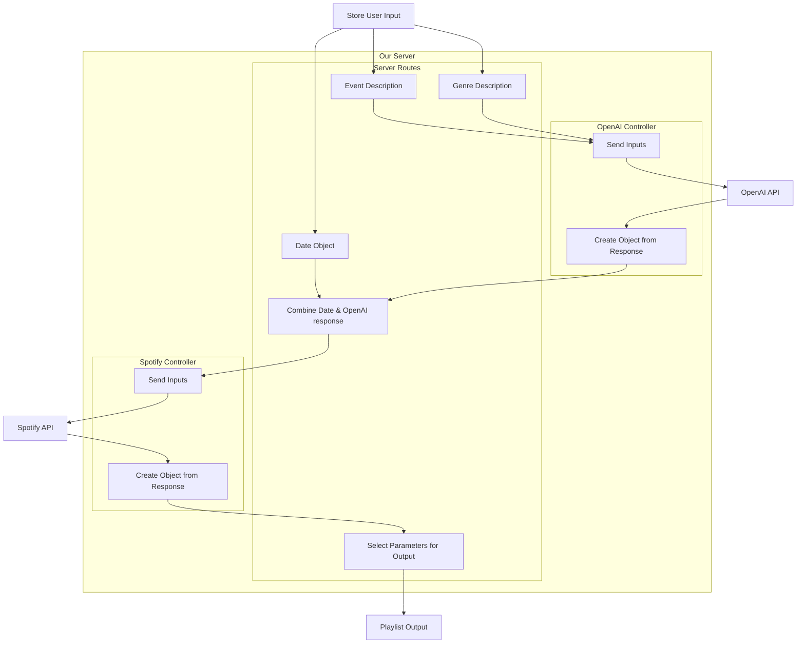
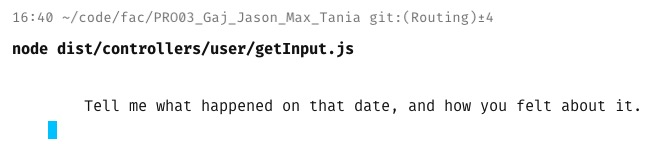
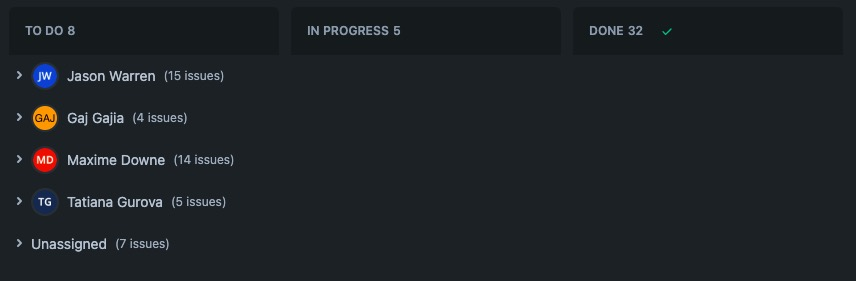
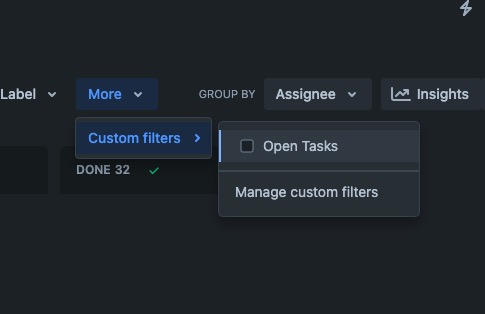
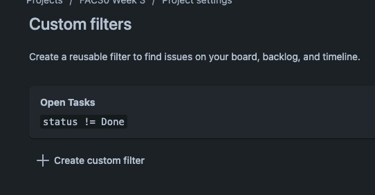
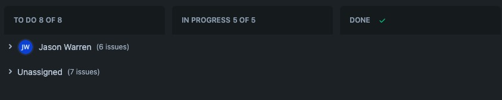
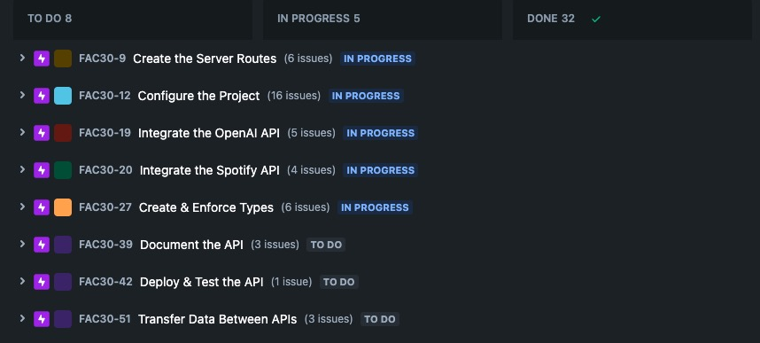
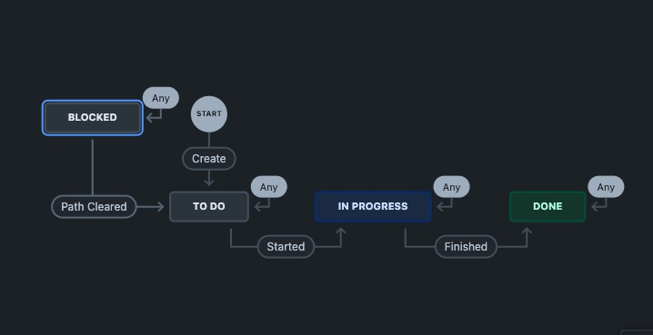

# Week 3: Back End (lol)

- [Learning Outcomes](https://learn.foundersandcoders.com/course/syllabus/developer/week03-project03-server/learning-outcomes/)

## 1. Achievements

<details><summary><strong>Understand & Use the Benefits of TypeScript</strong></summary>

---
I encouraged the developers working with specific APIs to specify what types of data they wanted to be given and what they would be sending back. Tanya needed two string inputs.

```ts
    export interface openaiQuery { eventDescription: string, musicGenre: string };
```

I was extracting those input strings from the user's input, but was also capturing a date that wouldn't be sent to openAI

```ts
    export interface userInput extends openaiQuery { date: Date };
```

Tanya would return two new strings & some numerical values corresponding to Spotify's recommendations engine

```ts
    export interface openaiResponse { mood: string, genre: string };

    export interface spotifyFeatures {
        valence: number, 
        energy: number,
        danceability: number,
        acousticness: number,
        tempo: number
    }
```

I would then send the recommendation scores to Gaj, along with the original captured date

```ts
    export interface spotifyQuery extends openaiResponse {
        date: Date,
        spotifyFeatures: spotifyFeatures
    };
```

---
</details>

<details><summary><strong>Designing Server Architecture</strong></summary>

---
I wanted to create a structure that was appropriate to the small size of our project, but also could accomodate changes & additions easily. This meant it was easy to adapt to Tanya's sudden discovery of embeddings on Thursday morning.

```ts
    // ./src/app.ts

    const app = express();
    const router = express.Router();
    app.use(routes);
```

```ts
    // ./src/routes/routes.ts

    import { router as openAI } from "./openAI/index.js";
    import { router as spotify } from "./spotify/index.js";
    app.use(openAI);
    app.use(spotify);
    export { router };
```

```ts
    // ./src/routes/openai/index.ts

    // import functions from corresponding file in ./src/controllers/
    app.get("/openAI", async (req: Request, res: Response) => {
        const input = await userInput();
        const output = await parseMood(input.eventDescription);
        return output;
    });
```

---
</details>

<details><summary><strong>Planning & Communicating the Structure of a Server</strong></summary>

---

I used mermaid.js syntax to quickly knock up a visual explainer of what our data was doing when a team member was finding it difficult to know which inputs & outputs they had to accomodate.



---
</details>

<details><summary><strong>Dev Scripts & Nodemon</strong></summary>

---

Setting this...

```json
    // ./nodemon.json
    {
        "watch": ["src"],
        "ext": "ts",
        "exec": "ts-node --esm -r tsconfig-paths/register ./src/app.ts"
    }
```

...and this...

```json
    // ./package.json
    "scripts": {
        "compile": "npx tsc",
        "server": "node dist/app.js",
        "dev": "nodemon"
    }
```

...means this...

```zsh
    npm run dev
```

...will run this...

```zsh
    nodemon ts-node --esm -r tsconfig-paths/register ./src/app.ts
```

...for the whole team without them needing to learn the flags.

---

</details>

<details><summary><strong>PromptSync is Awesome</strong></summary>

---

Take terminal input from the user with literally one line of code? Yeah, thankyou.

```zsh
    npm install promp-sync
```

```ts
    async function userInput(): userInput {
        const prompt = promptSync();

        const q1: string = prompt(`What happened on that date? How did you feel about it?`);
        const q2: string = prompt(`What genres of music do you like?`);

        const userInput: userInput = {
            eventDescription: q1,
            musicGenre: q2,
            date: new Date()
        };
        userInput.date.setFullYear(await prompt(`Type a 4 digit year`))
        userInput.date.setMonth(await prompt(`Type a 2 digit month`));
        userInput.date.setDate(await prompt(`Type a 2 digit day`));

        return userInput;
    }
```



---

</details>

<details><summary><strong>Project Management</strong></summary>

---

I wanted to make sure we took advantage of Jira's capabilities without overwhelming anyone. One approach was to create custom views so that team members could hide irrelevant tasks.



---

As the "done" column mounted, I also created a custom filter to hide completed tasks







---

For stand-ups, I created an alternate view so we could see our progress across areas.



---

I also created a custom "Blocked" status alongside the standard "To Do", "In Progress" & "Done", hidden by default. Then I used the Jira workflow designer to automatically block a task if it had an unresolved dependency and unblock it when ready



---
</details>

## 2. Difficulties

<details><summary>Toggle List</summary>

---

- Responding to difficulties being experienced by another developer when my primary role was to communicate with their code.
- Understanding the implications of apparently minor configuration choices on server architecture
- Helping other developers to communicate about the project clearly; there was a fair amount of "what do I do with it when it goes into it", and I wasn't as effective at helping people clear up their question as I would like to be.

---

</details>

## 3. Full Progress List

<details><summary>Toggle Key</summary>

---

- [X] I feel like I've learned/demonstrated this skill in the past week
- I have acquired some skill but need to develop further
- [ ] I am not yet comfortable in this skill

---

</details>

<details><summary>Toggle List</summary>

---

### TypeScript & Express

- Develop a server using Express and TypeScript for backend applications (K9, S1, S11, S12)
- [X] Identify the server’s role within a full stack application (K1, K2, K3)
- [X] Understand the benefits of using TypeScript over JavaScript, such as improved code quality, enhanced developer productivity, and better tooling support (K7, S1)
- [X] Learn the basic syntax and features of TypeScript (S1, S16)

---

### RESTFUL APIs

- [X] Grasp the concept and purpose of RESTful APIs (K11, S12)
- Construct and implement RESTful APIs effectively (S1, S11, S12, S16)
- [X] Determine appropriate scenarios for applying RESTful APIs (K7, S9, B2)
- Design endpoint structures for data creation, modification, and deletion (K11, S8, S12)
- Utilize Postman to test RESTful APIs independently of frontend components, ensuring proper functionality, error handling, and adherence to API specifications (S5, S6, S7)
- Gain experience in documenting the application’s architecture, API endpoints, and user guides for future reference and maintenance (S15, B4, B7, B8)
- [X] Practice creating JSON endpoints and using these endpoints to fetch and display data dynamically.
- Dynamically update web page content without needing to reload the page.

---

### Additional

- Utilize `node:fs` for filesystem operations (S1, S16)
- [X] Gain experience in using developer tooling, including IDEs, linters, and formatters, to enhance productivity (B3, B9)

---

</details>

## 4. Feedback

|                  |                         |
| ---------------- | ----------------------- |
| *Name*           |                         |
| *What Went Well* |                         |
| *Even Better If* |                         |
