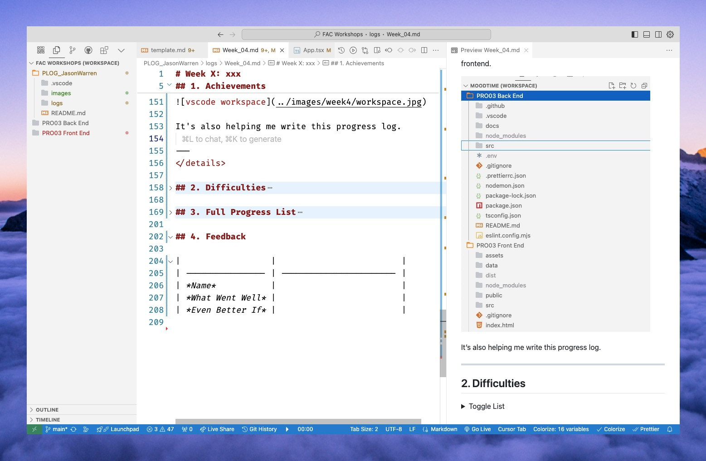

# Week 4: You Frontin', Bruv?

- [Learning Outcomes](https://learn.foundersandcoders.com/course/syllabus/developer/week04-project03-frontend/learning-outcomes/)

## 1. Achievements

<details><summary>Toggle List</summary>

<details><summary><strong>Commit Messages</strong></summary>

---
Realising that I was beginning to struggle to understand the impact of my team's code, I realised this probably meant that they, in turn, were struggling to understand my code.


Since then, I've tried to be more conscientious about writing clear commit messages.

---
</details>

<details><summary><strong>Using Project Structure to Support My Team</strong></summary>

---
As we were trying to create a cohesive aesthetic across multiple components, I wanted to make sure that we could benefit from the shared components across the pages. Organising them according to their purpose made this easier to understand.


I also suggested that we should create a `Content.tsx` component to act as the container for our pages.

```ts
function App() {
	return (
		<>
			<Header />
			<Content />
			<Footer />
		</>
	);
}
```

---
</details>

<details><summary><strong>Creating & Using Context</strong></summary>

---
I create a context in `Content.tsx`, the layout section that would contain our individual pages.

```ts
import { createContext, useState } from 'react';

export const UserContext = createContext({
	userName: "",
	setUserName: () => {},
});
```

I made the `UserContext` available to the `Content` component and its children by wrapping the `Content` component in a `UserContext.Provider`.

```ts
function Content() {
	const [userName, setUserName] = useState("");

	const userContextValue = {
		userName,
		setUserName,
	};
	
	return (
		<UserContext.Provider value={userContextValue}>
		<main>
			{renderPage()}
		</main>
		</UserContext.Provider>
	)
}
```

We can now access the `UserContext` in any of the components that are children of the `Content` component. 

We can use `setUserName()` on one page...

```ts
function LandingPage({ setUserName }) {
	const handleSubmit = (name) => {
		setUserName(name);
		onNext();
	};

	return (
		<>
			<LandingText />
			<NameForm onSubmit={handleSubmit} />
		</>
	)
}
```

...and access it in another page.

```ts
function PlaylistPage({ onNext }) {
  const { userName } = useContext(UserContext);

  return (
		<section>
			<p>{userName}, this is your</p>
			<p className="text-white">TOP 5</p>
		</section>
	);
}
```

---
</details>

<details><summary><strong>Creating a Dev Menu</strong></summary>

---
We were running into bottleneck issues; the sequential, data-triggered nature of our pages meant that the team couldn't preview the components in isolation.

So I knocked up a Dev Menu component that would allow us to preview the components in isolation.

```ts
	interface DevToolsProps { setCurrentPage: (page: string) => void }

	const DevTools: React.FC<DevToolsProps> = ({ setCurrentPage }) => {
		const pages = ['dummy', 'landing', 'input', 'loading', 'playlist'];

		return (
			<div style={{ position: 'fixed', bottom: 0 }}>
				{pages.map((page) => (
					<button key={page} onClick={() => setCurrentPage(page)}>
						{page}
					</button>
				))}
			</div>
		);
	};
```

I was able to do this quickly due to storing the `setCurrentPage()` function in a Context.

---
</details>

<details><summary><strong>VSCode Workspaces</strong></summary>

---
I discovered that VSCode has a feature called "Workspaces" that allows me to open multiple projects in the same editor. This helped a lot when making calls to our backend from our frontend.


It's also helping me write this progress log.



---
</details>

</details>

## 2. Difficulties

<details><summary>Toggle List</summary>

---

### Commit Messages

Whilst I started writing conventional commit messages, I didn't always follow this rule when I was tired or frustrated.

### Syntax vs Systems

> Bear with me, I'm kind of working this out while I type

<details><summary>This is LONG, so I'm putting it in a details tag</summary>

#### The Issue

My understanding of how to write code is much more advanced than my knowledge of the systems I am interacting with. When I can grasp the underlying structure of a system, I have a much easier time with it:

- TypeScript interfaces
- React components
- git commands

I know what I am doing when I type `git add .` vs `git commit`, and I can visualise the relationships between `App.tsx`, `Content.tsx` and `Landing.tsx`.

However, I am not improving as quickly in other areas.

- The `CORS` error
- asynchronous code
- CSS
- Understanding when & how to use `import` vs `require`

#### The Cause

I think this is a moment where my neurodivergence is beginning to rear its head in my developer role. I know from educational psychologist reports going back to 1991 that I have a fairly uncommon brain:

- I know that...
  - My ADHD symptomology is more severe than 95% of other people with ADHD
  - I'm also possibly diagnosably autistic (though this is debatable).
- However...
  - I am not dyslexic, which is *incredibly* uncommon with my severity of ADHD
  - My ability to conceptualise & extrapolate logical systems is in the 99.99% percentile.
  
There isn't yet enough research on this yet, partly because there aren't enough of us, but studies are beginning to identify that someone like me develops "hyperlexia". This is essentially being able to understand abstract systems very quickly (converting written text into ideas, conceptualising complex networks or relationships, etc.), but struggling when we don't have the right mental models to understand the world.

When I look back at the areas I'm struggling with, I can see that these are areas where I don't understand the fundamental logic of the system.

#### The Solution

I'm not sure yet, but I think I need to search for resources that can help me understand the underlying structure of these systems. I can't expect myself to abstract the idea of "Testing" just from writing tests; I need to understand what to test, when to test, different viewpoints on testing, etc. So I'm going to try doing that.

</details>

> SORRY FOR HOW LONG THAT WAS

---
</details>

## 3. Full Progress List

- [X] **I feel like I've learned/demonstrated this skill in the past week**
- [ ] *I have acquired some skill but need to develop further*
- [ ] I am not yet comfortable in this skill

<details><summary>Toggle List</summary>

---

### React

- [X] **Learn how to integrate TypeScript with a React**
- [ ] *Understand the concepts of components, props, and state in React*
- [X] **Implement routing in a single-page application using React Router**
- [ ] *Manage global state and side-effects in React applications*
- [ ] *Create reusable UI components and manage their lifecycle*
- [ ] *Handle asynchronous operations and manage data fetching in React*
- [ ] Follow best practices in React development

### Node 

- [X] **Set environment variables and understand their use case**

### Software Architecture 

- [X] **Draw a diagram representing the flow of our application**
- [X] **Follow a consistent pattern for naming our folders, files and variables**

---

</details>

## 4. Feedback

|                  |                         |
| ---------------- | ----------------------- |
| *Name*           |                         |
| *What Went Well* |                         |
| *Even Better If* |                         |
