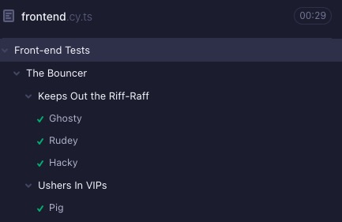
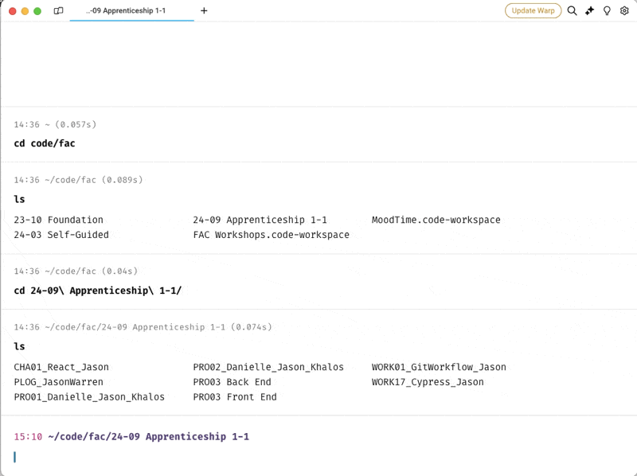

# Week 5: Test & Deploy

- [Learning Outcomes](https://learn.foundersandcoders.com/course/syllabus/developer/week05-project03-test-deploy/learning-outcomes/)

## 1. Achievements

<details><summary><strong>Cypress-Fu</strong></summary>

---
So organise! Very satisfy!



```ts
	const app = { button: 'button[type="submit"]' };

	describe('Front-end Tests', () => {
		beforeEach(() => { cy.visit('') })

		context('Landing Page', () => { /* some stuff */ })

		context ('Input Page', () => {
			beforeEach(() => { /* some stuff */ });
			
			context('Form Submission', () => { 
				it('does stuff', () => { 
					cy.get( app.button ).do( /* some stuff */ )
				})
			});
		})
	})
```

---
</details>

<details><summary><strong>Terminal Configurations</strong></summary>

---
This is delightful.

```yaml
name: Moodtime
	windows:
		- tabs:
			- title: Server
				layout:
					cwd: /Users/jasonwarren/Code/fac/24-09 Apprenticeship 1-1/PRO03 Back End
				color: blue
			- title: Front End
				layout:
					cwd: /Users/jasonwarren/code/fac/24-09 Apprenticeship 1-1/PRO03 Front End
				color: cyan
			- title: Cypress
				layout:
					cwd: /Users/jasonwarren/code/fac/24-09 Apprenticeship 1-1/PRO03 Front End
				color: yellow
			- title: Console
				layout:
					cwd: /Users/jasonwarren/code/fac/24-09 Apprenticeship 1-1/PRO03 Front End
				color: red
```



---
</details>

<details>
<summary><strong>Filtering Inputs</strong></summary>

---
Quick & dirty input validation

```ts
	import { Filter } from 'bad-words';

	function NameForm({ onSubmit }) {
		const [error, setError] = useState<string | null>(null);
		const filter = new Filter();
		const message = {
			warn: 'Please complete the form',
			scold: "Don't be a tit"
		}

		const validateName = (input: string): boolean => {
			if (input.trim() === '') {
				setError(message.warn);
				return false;
			} else if (filter.isProfane(input) || input.trim().includes('<')) {
				setError(message.scold);
				return false;
			} else {
				setError(null);
				return true;
			}
		};

		const handleSubmit = (event) => {
			event.preventDefault();
			if (validateName(name)) { onSubmit(name) };
		};

		return (<form></form>);
	}
```

---
</details>

## 2. Difficulties

<details><summary>Toggle List</summary>

---

- I lost track of what the hell was going on with the deployment process after a while. I need to figure out a better way to keep informed about the areas of the project that I'm not actively working on.

---
</details>

## 3. Full Progress List

<details><summary>Toggle Key</summary>

---

- [X] **I feel like I've learned/demonstrated this skill in the past week**
- [X] *I have acquired some skill but need to develop further*
- [ ] I am not yet comfortable in this skill

---

</details>

<details><summary>Toggle List</summary>

---

### Testing

- [X] **Learn how to write and run unit tests for backend functionality using the Node testing suite and Postman**
- [X] **Gain experience in using the Cypress testing library with React**
- [X] *Understand how and when to use component and end to end tests*
- [X] *Understand how to write maintainable and readable test cases*

---

### Deployment

- [X] *Gain experience in deploying a full-stack web application to a cloud platform*
- [X] **Understand the differences between development, staging, and production environments**
- [X] *Configure the necessary environment variables and settings for deployment*
- [X] *Understand the process of building and optimizing the application for production*
- [ ] Learn how to set up and configure a production environment on a cloud platform
- [ ] Gain experience in using a continuous integration and deployment (CI/CD) pipeline

---

### Additional

- [ ] 

---

</details>

## 4. Feedback

| Name                       |                         |
| -------------------------- | ----------------------- |
| *Why This is Brilliant*    |                         |
| *Unrealistic Expectations* |                         |
