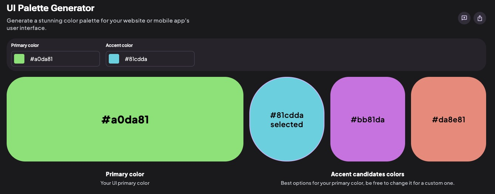
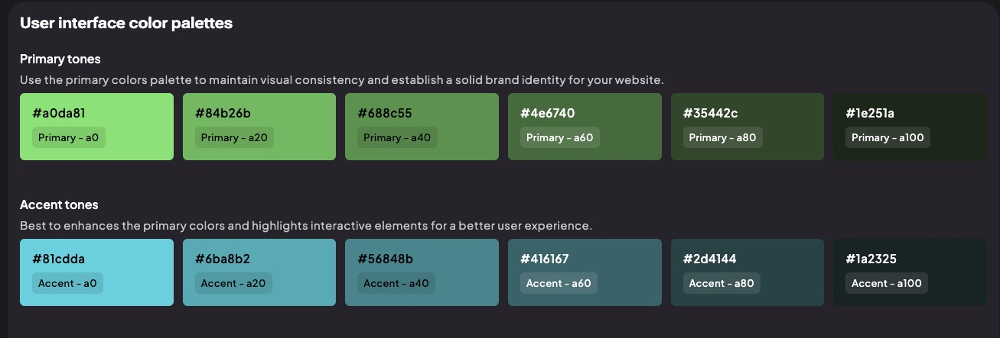
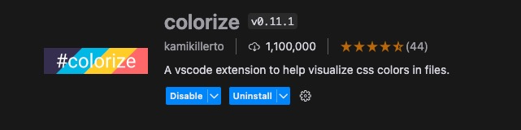
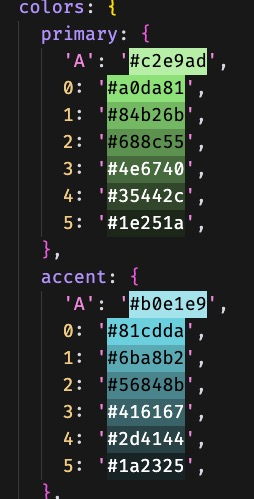

# Week 6: Databases

- [Learning Outcomes](https://learn.foundersandcoders.com/course/syllabus/developer/week06-project04-databases/learning-outcomes/)

## 1. Achievements

<details>
<summary>Communicating Ontology with Entity Relationship Diagrams</summary>

---

I had some experience with SQL, and more in the general nature of data ontology. Riley was assigned the task of creating the database, and I wanted to support him learning a new skill without taking over.

I found a [VSCode extension](https://marketplace.visualstudio.com/items?itemName=dineug.vuerd-vscode) that allowed me to create ERDs in our repository, which meant I could create a diagram of the database schema without touching SQL syntax. This freed up Riley to focus on learning the syntax without simultaneously learning the idea of data ontology.

---
</details>

<details>
<summary>Custom npm Scripts</summary>

---

I had some experience with npm scripts from the previous weeks, but I wanted to learn more about how to use them to automate tasks.

While doing the SQLite workshop, I created a script to delete `db.sqlite`from the command line so that I could play around with multiple schemata.

```src
Workshop 19 • SQLite/
┣ database/
┣ model/
┣ utils/
┃ ┗ deleteFile.js
┣ db.sqlite
┣ package.json
```

```json
/* ./package.json */

{
	/* blah blah */,
	"scripts": {
		"clean": "node utils/deleteFile.js",
		"db": "DB_FILE=db.sqlite node database/db.js",
		"seed": "DB_FILE=db.sqlite node database/seed.js"
	},
	/* blah blah */
}
```

```ts
/* ./utils/deleteFile.js */

const fs = require('fs');
const path = require('path');

const filePath = path.join(__dirname, '../db.sqlite');

fs.unlink(filePath, (err) => {
    if (err) {
        console.error(`Error deleting file: ${err.message}`);
        return;
    }
    console.log('File deleted successfully');
});
```

---
</details>

<details>
<summary>Tailwind: Custom Colours</summary>

---

I used an online tool to help me create a colour palette for the project.





I could then define them in `tailwind.config.js` like this:

```json
/* ./tailwind.config.js */

export default {
  theme: {
    extend: {
      colors: {
        primary: {
          'A': '#c2e9ad',
          0: '#a0da81',
          1: '#84b26b',
          2: '#688c55',
          3: '#4e6740',
          4: '#35442c',
          5: '#1e251a',
        },
        accent: {
          'A': '#b0e1e9',
          0: '#81cdda',
          1: '#6ba8b2',
          2: '#56848b',
          3: '#416167',
          4: '#2d4144',
          5: '#1a2325',
        }
			}
    }
  }
}
```

By using the Colorize extension, I could refer to that config file and see the colours in the editor.





---
</details>

<details>
<summary>Tailwind: Typography</summary>

---

For prototyping, as I was designing the entire frontend, I didn't want to get stuck in the weeds writing styling for every level of header... but Tailwind removes all default styling from text. Enter the [Tailwind Typography](https://tailwindcss-typography.vercel.app/) package.

Once installed, I could use the `prose` class to apply minimal default typography styles to any child element.

```ts
function Header() {
  return (
    <header className='prose bg-primary-2'>
			<h1>Craft & Graft</h1>
    </header>
  )
}
```

---
</details>

<details>
<summary>Tailwind: Custom Classes</summary>

---

Firstly, props to Dani for teaching me how to create custom classes in Tailwind. Previously I had assumed that, since Tailwind builds upon CSS, I couldn't use Tailwind classes within the base CSS file.

```css
/* ./src/styles/index.css */

@tailwind base;
@tailwind components;
@tailwind utilities;

.button-bonbon {
	@apply w-full px-6 py-2 rounded-full text-lg bg-primary-0 text-primary-4 border border-primary-1;
}
```

```tsx
/* ./src/components/view/Landing.tsx */

export function LandingView() {
  return (
    <section>
      <p>Your one-stop shop for all your leisure and hobby needs</p>
      <button className="button-bonbon">Start Shopping</button>
    </section>
  );
}
```

---
</details>

---

## 2. Difficulties

No particular difficulties this week, but I look forward to getting deeper into Context.

---

## 3. Full Progress List

<details>
<summary>Expand Key</summary>

---

- [X] **I feel like I've learned/demonstrated this skill in the past week**
- [X] *I have acquired some skill but need to develop further*
- [ ] I am not yet comfortable in this skill

---
</details>

### List

<details>
<summary>Databases</summary>

---

- [X] **Learn how to design and structure a database schema for the application**
- [ ] Implement CRUD (Create, Read, Update, Delete) operations for products and orders
- [X] *Acquire skills in using SQLite to manage and query relational data efficiently*
- [X] *Be comfortable with SQL syntax and how to use SELECT and INSERT queries*

---
</details>

<details>
<summary>React</summary>

---

- [X] **Gain proficiency in using React to create dynamic and responsive user interfaces**
- [X] *Understand the use of state management in React to handle the shopping cart functionality*

---
</details>

---

## 4. Feedback

| *Name* | *What Went Well* | *Even Better If* |
| ------ | ---------------- | ---------------- |
|        |                  |                  |
