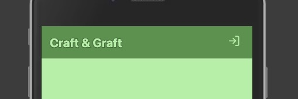
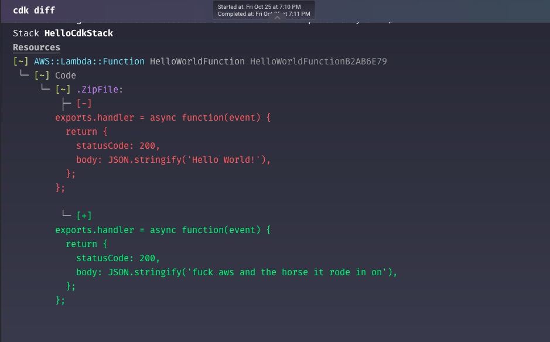
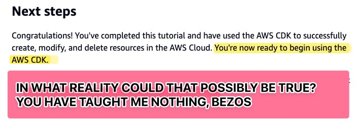

# Week 7: Authentication

- [Learning Outcomes](https://learn.foundersandcoders.com/course/syllabus/developer/week07-project04-authentication/learning-outcomes/)

## 1. Achievements

<details>
<summary>Event Bubbling: A Detective Story</summary>

---

I was pleased with this one, as I managed to solve it using only console logging and one tiny bit of googling. This is the `<Header/>` component, which sits right at the top level of my `<App />`.



Inside it are two elements. 

On the left, we have a `<div />` to hold the `<h1>` and, eventually, a logo. The `<h1>` carries an `onClick` handler that sets `view` (a state in the `StoreContext` that dictates which components render in the main `Content` section) to `"landing"`.

On the right, `<UserButtonGroup />` holds `<LogInButton />` (or other buttons for a logged in user). That button's `onClick` handler sets `view` to `"login"`.

And yet... when I clicked the login button, the landing page would appear. I added console logs everywhere:

- the login button's `handleClick()`, to make sure the right element registered a click
- `function Content() { ... }` component, to see what it thought the `view` state was
- the `<h1>`'s `onClick()`, to see if it was somehow being called

Eventually, I realised there was one place I wasn't logging; my contexts are stored in their own components, and I hadn't added any logs to the state itself. I added a log within a `useEffect()` triggered by changes to `view` and I saw that the state *was* being correctly set to `"login"`... but a fraction of a second later, it was set back to `"landing"`.

I didn't know about event bubbling at this point, but I understood the structure of the code well enough to know the following:

- The `onClick()` handler in the button was being called correctly.
- By the time `<Content />` checked value of `view`, it had been set back to `"landing"`
- Something in between `<LogInButton />` and `<Content />` was calling `setView("landing")`
- The possible culprits were:
	1. `<UserButtonGroup />`
	2. `<Header />`
	3. `<App />`
	4. `<Content />`

I had already ruled out `<Content />`, there is barely any code in `<App />` and `<UserButtonGroup />` was just a wrapper with no access to the state. `<Header />` was the only option left, but to make sure I also added logs to each of these components that would fire when their exported function was called and when they were about to return.

```zsh
Login Button clicked by logged out user
Setting view to: login
Calling UserButtonGroup
Calling Header
Setting view to: landing
Calling Content
Calling return on Content: landing
```

There it was. Somehow, `setView()` was being called in `<Header />`. I knew intuitively that this had to be somehow related to the `onClick()` handler in the `<h1>` element, but at that point I was at the limit of my detective skills and dove into StackOverflow.

---
</details>

<details>
<summary>Quantums: Components to Handle Conditional Content</summary>

---

I settled on a type of component that would exist purely to handle conditional content. They would be fragments that contained a ternary operator with the following structure:

```ts
import { useUser } from "../../context/User";
import componentTrue from "../category/componentTrue";
import componentFalse from "../category/componentFalse";

function Quantum() {
	const { stateToCheck } = useUser();

	return (
		<>
			{stateToCheck === "true" ? <componentTrue /> : <componentFalse />}
		</>
	)
}
```

The most obvious use case for this is a login/logout button.

```ts
import { useUser } from '../../context/User'
import LogInButton from '../buttons/LogInButton';
import LogOutButton from '../buttons/LogOutButton'

function LogButtonQuantum () {
	const { isLoggedIn } = useUser();

  return (
		<>
			{isLoggedIn ? <LogOutButton /> : <LogInButton />}
		</>
	)
}

export default LogButtonQuantum
```

---
</details>

<details>
<summary>Form Inputs with Autocomplete Attributes</summary>

---

The autocomplete attribute is a string that hints at what the input is for. It is used by browsers to pre-fill the input, and is also used by password managers to identify what kind of password is being used.

```tsx
<input
	type="email"
	placeholder="email"
	autoComplete="section-login email"
	value={email}
	onChange={(e) => setEmail(e.target.value)}
/>

<input
	type="password"
	placeholder="Password"
	autoComplete="section-login password"
	value={password}
	onChange={(e) => setPassword(e.target.value)}
/>
```

The `section-` prefix is used to identify the input as part of a group called "login". This is especially useful for password managers, as it can help them identify when to autofill an input.

As our ecommerce site grows, we will be adding more and more forms, and this method will help keep the user experience smooth.

---
</details>

<details>
<summary>One Form, Two Submit Buttons</summary>

---

To speed up our initial development of a full-stack authentication system, I wanted to have a single form that could be used for both login and signup.

I created a `{ action, setAction }` state in the `LogInForm` component, and passed it down to the form's submit button.

```tsx
<button
	type="submit"
	onClick={() => setAction('login')}
	className="button-tictac"
>
	Log In
</button>

<button
	type="submit"
	onClick={() => setAction('signup')}
	className="button-tictac"
>
	Sign Up
</button>
```

Clicking on either button does the following:

1. The button's `onClick` handler sets the `action` state to either `"login"` or `"signup"`.
2. The button's `type` attribute is set to `"submit"`, which calls the form's `onSubmit` handler.

See the next section for the `onSubmit` handler.

---
</details>

<details>
<summary>The Biggest `onSubmit` Handler Ever Recorded</summary>

---

This component has admittedly grown absolutely unwieldy and will need some breaking apart, but I'm still pleased with it. I'll walk through a stripped down version, with most types, some error handling and some logging removed.

```ts
const { setIsLoggedIn } = useUser();
const { setView } = useContext(StoreContext);

const [action, setAction] = useState<'login' | 'signup'>();
const [email, setEmail] = useState("");
const [password, setPassword] = useState("");
```

Here we import the functions to set the logged in state from User and the page view state from Store.

We also create the `action`, `email` and `password` states, which are used only within this component and thus aren't stored in either context.

These local states have been updated by the form. The action was set by the button clicked, and the email and password have been updated by the input fields.

```tsx
const handleSubmit = async (e) => {
	e.preventDefault();

	if (!email || !password) {
		alert('Please fill in both email and password');
		return;
	}
```

So first we've prevented the default action of the form, and checked that both email and password have been entered. If not, we get an alert popup which can be dismissed by the user. A convenient side effect of this is that the user doesn't have that horrible experience of mistyping one field then having to re-enter the whole form.

```tsx
	const server = 'http://localhost:3000/auth/';
	const route = ((action === 'login') ? 'log-in' : 'sign-up');
	const endpoint = `${server}${route}`;
```

We then set the endpoint to the correct route based on the action.

```tsx
	const username = email.match(/^([^@]+)/)?.[1] || '';

	let body;
	if (action === 'login') {
		body = { email, password };
	} else {
		body = { username, email, password };
	}
```

Late in the process, I realised that the backend's `sign-up` route was expecting a `username` field. Rather than add a new component and all the logic, I knocked up and quick and dirty regex that sets the username by extracting the text before the "@" in the email address.

We then set the body of the request by using our `action` state to decide which fields to include.

```tsx

	try {
		const response = await fetch(endpoint, {
			/* this block includes the session cookie */
		});

		if (response.ok) {
			alert(`${action} successful`);
			setIsLoggedIn(true);
			setView('landing');
		} else {
			const errorText = await response.text();
			alert(`${action} failed: ${errorText}`);
		}
	} catch (error) {
		alert(`Error during ${action}: ${error.message}`);
	}
}
```

Finally, we have success actions & two types of error handling; server errors & user errors.

- The `try { if(response.ok) }` block will fire if the fetch request is successful & the user's inputs are accepted; it confirms this to the user, sets the logged in state and redirects to the landing page.
- The `try { else }` block will fire if the fetch request is successful but the user's inputs are rejected; it confirms this to the user, states which details aren't accepted and stays on the same page.
- The `catch` block will fire if there is an error with the fetch request itself.

---
</details>

---

## 2. Difficulties

<details>
<summary>The AWS Guide Writer is a Psychopath</summary>

---



So I absolutely hated this tutorial, because it commits the one sin that most aggravates me in instructional design: I was able to complete the entire exercise with no mistakes and come out the other side with absolutely no ability to use those principles in my own work. What did I just do?



---
</details>

<details>
<summary>Working Usefully with Tech for Better Product Owners</summary>

---

I found that it was difficult to get started with the exercise, due to the following:

- There were slightly different interpretations of what the exercise was asking for.
- We were being polite to each other and trying not to dominate the conversation.
- It's unclear to what extent we were expected to contribute ideas or highlight issues.

---
</details>

---

## 3. Full Progress List

### Key

<details>
<summary>Toggle Key</summary>

---

- [X] I feel like I've learned/demonstrated this skill in the past week
- I have acquired some skill but need to develop further
- [ ] I am not yet comfortable in this skill

---

</details>

### List

<details>
<summary>Authentication</summary>

---

- [X] Learn how to handle user registration, login, and logout functionality securely
- [X] Understand the principles of authentication and authorisation in web applications
- [ ] Develop strategies to mitigate security threats such as Cross-site Request Forgery (CSRF) attacks

---
</details>

<details>
<summary>React</summary>

---

- [ ] Implement navigation between different pages using React Router
- [X] Understand using the context API and how it can help with complicated state management in React
- Have working knowledge of the useReducer hook and how it can aid in using useContext for state management

---
</details>

---

## 4. Feedback

|                  |                         |
| ---------------- | ----------------------- |
| *Name*           |                         |
| *What Went Well* |                         |
| *Even Better If* |                         |
